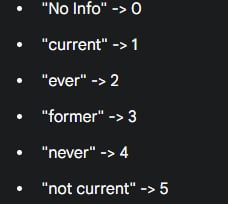
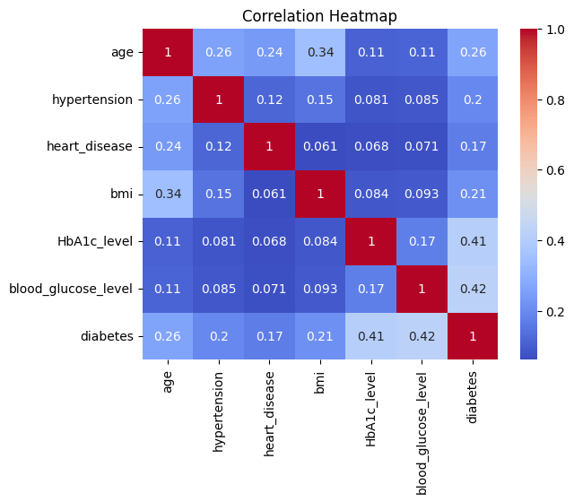
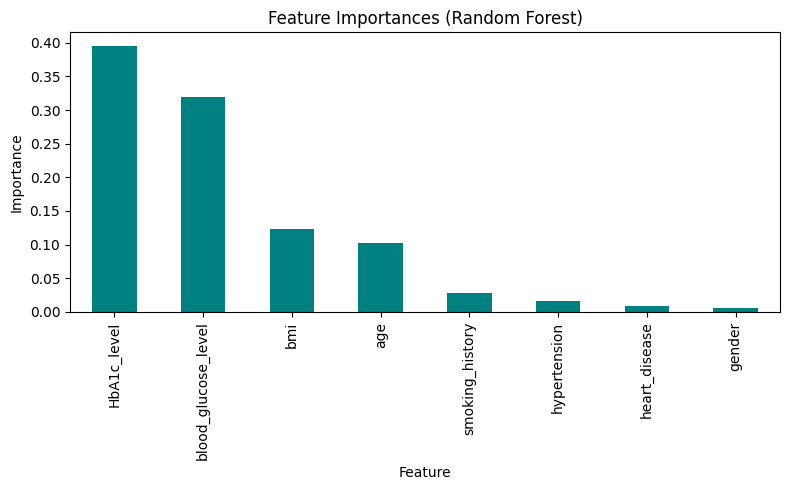
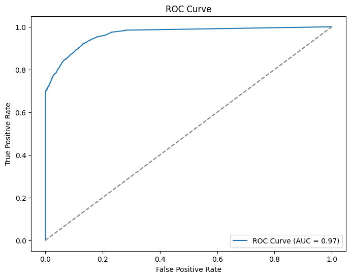
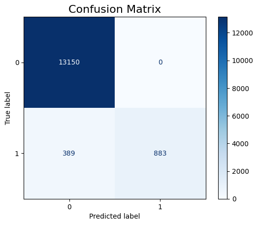

# **Diabetes Prediction Using Machine Learning: A Technical Report**

### **1. Introduction**

This project's primary objective was to develop a machine learning model capable of accurately predicting the onset of diabetes based on key patient health indicators. Early and accurate prediction of diabetes is crucial for timely intervention and management, potentially reducing the severity of complications associated with the disease.

The dataset for this study, titled **"Diabetes Prediction Dataset,"** was sourced from the Kaggle platform. It was created by Mohammed Mustafa and provides a comprehensive collection of medical and demographic data for diabetes prediction. The dataset comprises 100,000 entries and 9 distinct features, including demographic information (age, gender), lifestyle factors (smoking history), and critical medical measurements such as Body Mass Index (BMI), HbA1c level, and blood glucose level. The target variable indicates the presence (1) or absence (0) of diabetes. [Diabetes Prediction Dataset - Kaggle](https://www.kaggle.com/datasets/iammustafatz/diabetes-prediction-dataset/data)

---

### **2. Data Description and Preprocessing**

A systematic approach was undertaken to analyze, clean, and prepare the data for model training.

#### **2.1. Exploratory Data Analysis and Cleaning**

Initial analysis revealed a dataset of 100,000 rows and 9 columns with no missing values. However, 3,854 duplicate entries were identified and subsequently removed, resulting in a cleaned dataset of 96,146 unique records. The dataset exhibited a significant class imbalance, with only about 8.5% of the records corresponding to patients with diabetes. Categorical features like `gender` and `smoking_history` were encoded into numerical format using label encoding to make them suitable for machine learning algorithms.

*Figure: Encoding of smoking history categories into numerical values*

#### **2.2. Feature Selection and Data Splitting**

To identify the most influential predictors, feature importance was evaluated using a Random Forest Classifier. The analysis highlighted that **HbA1c level** and **blood glucose level** were the most significant predictors. The top five features were selected for model training to reduce dimensionality and improve model efficiency.

**Selected Features:**

* `HbA1c_level`
* `blood_glucose_level`
* `bmi`
* `age`
* `smoking_history`

The dataset was then split into three subsets: a training set (70%), a validation set (15%), and a testing set (15%), using stratified sampling to maintain the original class distribution in each subset.

#### **2.3. Handling Class Imbalance and Scaling**

Due to the class imbalance observed in the training data, the Synthetic Minority Over-sampling Technique (SMOTE) was applied. This method balanced the training set by generating synthetic samples for the minority class (diabetes patients), preventing the model from being biased towards the majority class. For models sensitive to feature scale, such as Logistic Regression and K-Nearest Neighbors, `StandardScaler` was used to normalize the feature distributions.

---

### **3. Model Training and Evaluation**

Several classification algorithms were trained and evaluated to identify the best-performing model for this prediction task. The models tested include:

* Logistic Regression
* Decision Tree Classifier
* Random Forest Classifier (with and without class weighting)
* Multi-Layer Perceptron (MLP)
* Deep Neural Network (DNN)
* XGBoost Classifier
* K-Nearest Neighbors (KNN)

The models were evaluated using standard performance metrics, including accuracy, precision, recall, F1-score, and the Area Under the Receiver Operating Characteristic (ROC-AUC) curve. The **Random Forest Classifier with class weighting and hyperparameter tuning** demonstrated the most robust and balanced performance, particularly in terms of F1-score and its ability to handle the imbalanced nature of the data. It was therefore selected as the final model.

Below are key visualizations from the analysis and evaluation process.

**Figure 1. Correlation Matrix:** This heatmap illustrates the linear relationships between numerical features. `Age`, `blood_glucose_level`, and `HbA1c_level` show the strongest positive correlations with the `diabetes` outcome.

**Figure 2. Feature Importance Plot:** This plot, derived from the Random Forest model, ranks features by their predictive power. `HbA1c_level` and `blood_glucose_level` are clearly the most influential features for predicting diabetes.

**Figure 3. ROC Curve:** The Receiver Operating Characteristic curve for the final model on the test set. An AUC score of 0.97 indicates excellent discrimination capability between positive and negative classes.

**Figure 4. Confusion Matrix:** This matrix visualizes the performance of the final model on the test set. It shows a high number of true negatives (13150) and a good number of true positives (883), but also highlights 389 false negatives.

---

### **4. Results and Discussion**

The final tuned Random Forest model achieved a high overall **accuracy of 97.3%** on the unseen test data. The detailed performance metrics are as follows:

* **Precision (Positive Class): 1.00**
* **Recall (Positive Class): 0.69**
* **F1-score (Positive Class): 0.82**
* **ROC-AUC Score: 0.97**

The model demonstrates exceptional precision for the positive class, meaning that when it predicts a patient has diabetes, it is almost always correct. This is crucial for avoiding false alarms. However, the recall of 0.69 indicates that the model fails to identify approximately 31% of actual diabetes cases (389 false negatives). This trade-off between precision and recall is a critical consideration. In a clinical setting, minimizing false negatives might be prioritized to ensure all at-risk patients receive attention, even at the cost of lower precision. The optimal classification threshold was adjusted to `0.89` to balance these metrics, prioritizing the F1-score.

---

### **5. Technical Summary of the Saved Model**

The trained model has been saved as a `pickle` file (`diabetes-random_forest_model.pkl`) for future deployment, such as integration into an API.

* **Input Parameters:** The model expects a NumPy array or a list containing values for the five selected features, in the following order:

  1. `HbA1c_level` (float)
  2. `blood_glucose_level` (integer)
  3. `bmi` (float)
  4. `age` (float)
  5. `smoking_history` (integer, label-encoded)
* **Output:** The model's `predict()` method returns a binary prediction:

  * `0`: No diabetes predicted.
  * `1`: Diabetes predicted.

  The `predict_proba()` method can be used to obtain the probability of each class.

---

### **6. Conclusion**

This project successfully developed a high-performing machine learning model for diabetes prediction. Through systematic data preprocessing, feature selection, and comparative model evaluation, a Random Forest Classifier was identified as the most effective algorithm, achieving an accuracy of 97.3% on the test set. The model exhibits high precision, making its positive predictions highly reliable.
