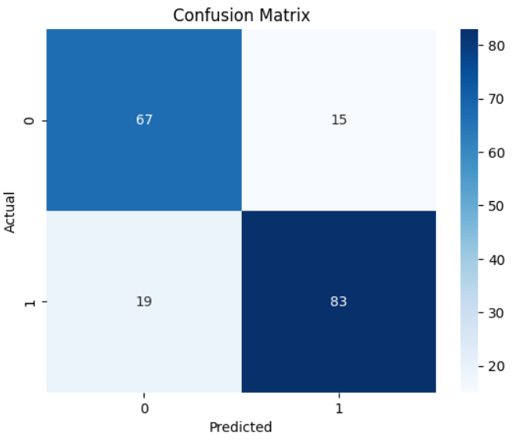
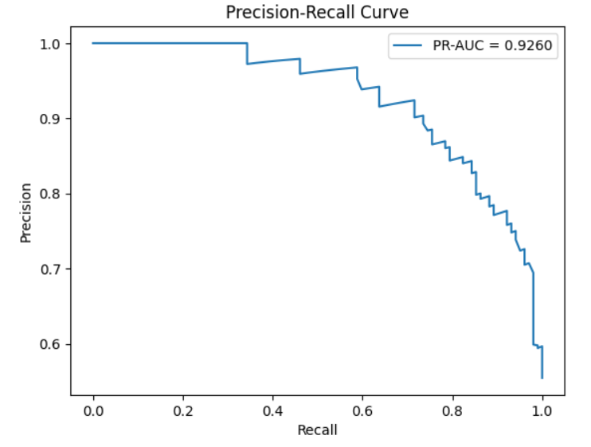

# **Heart Attack Prediction Using AdaBoost: A Technical Report**

### **1. Introduction**

The primary goal of this project was to develop a robust machine learning model capable of predicting the likelihood of a **heart attack** based on key clinical and demographic indicators. Early prediction of heart disease risk is critical for preventative healthcare, enabling timely intervention and improved patient outcomes.

The dataset used in this study was compiled from **four hospital-based datasets** sourced from the [UCI Machine Learning Repository: Heart Disease Dataset](https://archive.ics.uci.edu/dataset/45/heart+disease). These are real clinical data (not synthetic), manually merged to create a unified dataset for analysis and modeling.

---

### **2. Data Description and Preprocessing**

A comprehensive data preprocessing workflow was applied to ensure data quality and model reliability.

#### **2.1. Missing Value Analysis**

Initial exploration revealed several features with varying proportions of missing values:

| Feature    | Missing (%)  |
|------------|--------------|
| trestbps   | 6.41% |
| chol       | 3.26% |
| fbs        | 9.78% |
| restecg    | 0.22% |
| thalach    | 5.98% |
| exang      | 5.98% |
| oldpeak    | 6.74% |
| slope      | 33.59% |
| ca         | 52.83% |
| thal       | 66.41% |

Due to an excessive number of missing values, the features **`slope`**, **`ca`**, and **`thal`** were **dropped** from the dataset.  
The remaining missing values were imputed using **KNNImputer (n_neighbors=5)** to preserve data relationships and structure.

#### **2.2. Target Variable Definition**

The dataset’s original target column `num` represented the degree of heart disease presence (0–4). To simplify the classification task, it was converted into a **binary target variable** indicating disease presence (1) or absence (0).

### **3. Model Training and Evaluation**

Multiple machine learning models were evaluated using cross-validation to determine the most effective approach for heart attack prediction. The following results summarize their average cross-validation performance:

| Model | CV Accuracy (Mean ± Std) |
|--------|---------------------------|
| **AdaBoost** | **0.8139 ± 0.0205** |
| Logistic Regression | 0.8112 ± 0.0205 |
| Gradient Boosting | 0.8071 ± 0.0318 |
| Extra Trees | 0.8058 ± 0.0289 |
| Random Forest | 0.8003 ± 0.0321 |
| SVM | 0.8003 ± 0.0220 |
| K-Nearest Neighbors | 0.7894 ± 0.0228 |

The **AdaBoost Classifier** demonstrated the best overall performance and was selected as the final model.

---

### **4. Feature Selection and Optimization**

The two least significant features — `fbs` and `restecg` — were removed to simplify the model without compromising performance.

**Final Selected Features:**

1. `age`  
2. `sex`  
3. `cp`  
4. `trestbps`  
5. `chol`  
6. `thalach`  
7. `oldpeak`  
8. `exang`

---

### **5. Model Performance**

After retraining the optimized AdaBoost model, the following results were obtained:

| Metric | Value |
|---------|--------|
| Cross-Validation Accuracy | **0.8139** |
| Test Set Accuracy | **0.8152** |
| Generalization Gap | **0.0014** |
| ROC-AUC Score | **0.9027** |
| Precision-Recall AUC | **0.9260** |

**Classification Report:**

| Class | Precision | Recall | F1-score | Support |
|--------|------------|---------|-----------|----------|
| No Disease | 0.78 | 0.82 | 0.80 | 82 |
| Disease | 0.85 | 0.81 | 0.83 | 102 |
| **Accuracy** | | | **0.82**  | 184 |
| **Macro Avg** | **0.81** | **0.82** | **0.81** | 184 |
| **Weighted Avg** | **0.82** | **0.82** | **0.82** | 184 |

**Confusion Matrix:**

**Figure 1. Confusion Matrix:** This matrix visualizes the performance of the final model on the test set.

**Figure 2. Precision-Recall Curve:**

---

### **6. Feature Importance Visualization**

**Table: AdaBoost Feature Importances**

| Feature | Abs Importance |
|----------|-------------|
| chol | 0.204 |
| trestbps | 0.201 |
| oldpeak | 0.175 |
| thalach | 0.133 |
| cp | 0.112 |
| age | 0.088 |
| sex | 0.050 |
| exang | 0.037 |

The model identified **cholesterol**, **resting blood pressure**, and **ST depression (oldpeak)** as the strongest predictors of heart disease.

---

### **7. Technical Summary of the Saved Model**

The trained model was serialized and saved as a `pickle` file for future deployment.

**File:** `heart_attack-ada_boost_model.pkl`

**Expected Input:**  
The model expects eight numerical input values corresponding to the following features:

1. `age`:  [integer] age in years 
2. `sex`:  [integer] (1 = male; 0 = female) 
3. `cp`:  [integer] chest pain type (1 = typical angina; 2 = atypical angina; 3 = non-anginal pain; 4 = asymptomatic)
4. `trestbps`:  [integer] resting blood pressure
5. `chol`:  [integer] serum cholestoral in mg/dl 
6. `thalach`:  [integer] maximum heart rate achieved
7. `oldpeak`:  [float] ST depression induced by exercise relative to rest (oldpeak >= 0)
8. `exang`:  [integer] exercise induced angina (1 = yes; 0 = no)

**Output:**  
- `0`: No heart disease predicted  
- `1`: Heart disease predicted  
- The `predict_proba()` method can be used to obtain probability estimates for each class.

---

### **8. Conclusion**

This project successfully developed a reliable and interpretable AdaBoost model for **heart attack risk prediction** using real-world hospital data.  
Through meticulous preprocessing, feature optimization, and comparative model evaluation, the final AdaBoost classifier achieved an **accuracy of 82%** and **ROC-AUC of 0.90**, showing strong clinical applicability for early detection support systems.
